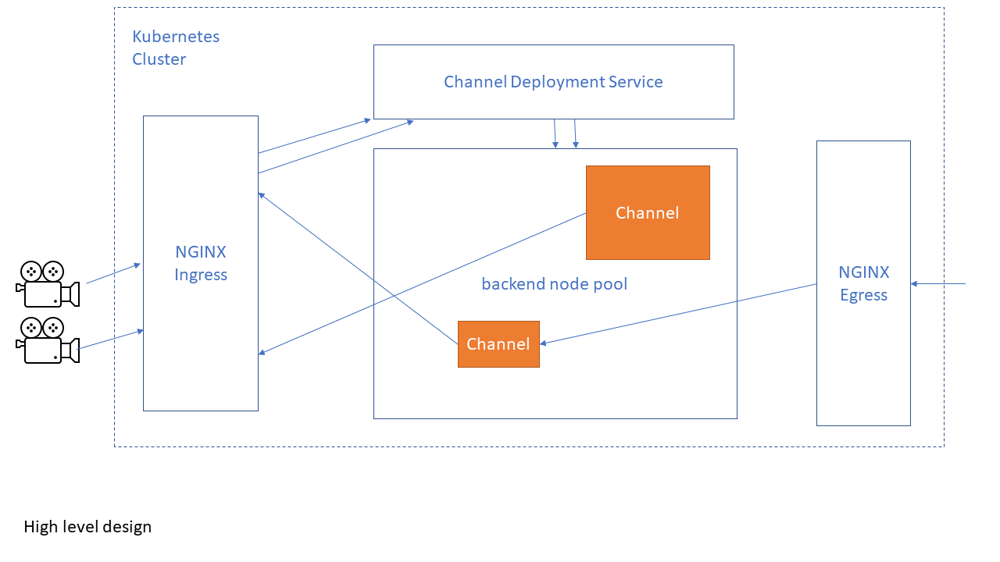

# livestream
A kubernetes based live streaming infrastructure.

# Architetcure.

# Features

* An [Ngnix](https://www.nginx.com/) based ingest frontend. Used the [nginx-rtmp](https://github.com/arut/nginx-rtmp-module) module for RTMP ingest.
* An [ffmpeg](http://ffmpeg.org) based mutli bitrate encoder. The encoding can be either CPU or GPU based.
* Support DASH/HLS for playback.
* A .NET CORE deployment service that deploys channels on demand.
* An nginx egress to stream the DASH/HLS segments and manifest.
* Simple [Shaka player](https://github.com/google/shaka-player) based player for testing the streaming.
* Low latency streaming with DASH low latency.

# Future enhancements.

* A simple REST API to manage channels.
* Authentication support (Both for ingest and playback)
* A well defined channel interface so multiple types of chanels can be implemented (gstreamer/ffmpeg)
* Move the channel infrastrcuture to Rust for efficiency.
* Support for Apple LL-HLS
* Support for configurable presets for encoding instead of hardcoded set of layers.
* Support for archiving to cloud storage
* DASH/SRT ingest
* Support for AI and close captioning.
